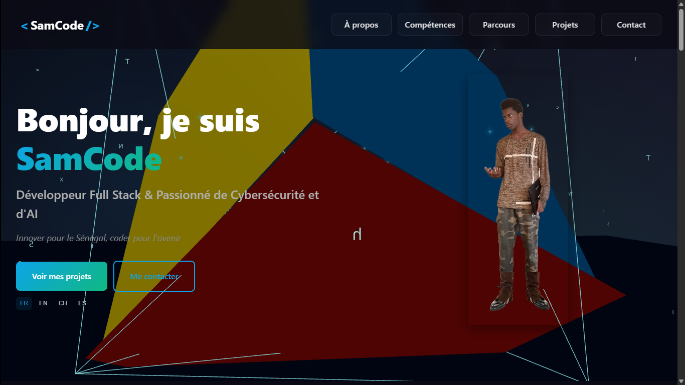

<div align="center">

  <!-- 🎨 PROJECT BANNER -->
  <!-- A good banner helps make your project stand out. -->
  <!-- You can create one using tools like Canva or Figma. -->
  

  <br>
  <br>

  <!-- 📛 BADGES -->
  <!-- Replace placeholders with your actual URLs -->
  <p>
    <a href="hhttps://github.com/MegasterPro/SamCode/actions/workflows/ci.yml">
      
    </a>
    <a href="https://www.npmjs.com/package/your-package">
      
    </a>
    <a href="https://github.com/your-username/your-repo/blob/main/LICENSE">
      
    </a>
  </p>

  <h1 align="center">SamCode Project</h1>

  <p align="center">
    A stunning 3D web experience built with React, Vite, and Three.js.
    <br>
    <a href="https://youtube.com/@SamCodexy"><strong>View Youtube »</strong></a>
    <br>
    <br>
    <a href="https://github.com/MegasterPro/SamCode/issues">Report Bug</a>
    ·
    <a href="https://github.com/MegasterPro/SamCode/issues">Request Feature</a>
  </p>
</div>

---

## 🌟 About The Project

<!-- 🖼️ PROJECT SCREENSHOT -->
<div align="center">
  
</div>

<p>
  This project is a modern, interactive 3D application for the web. It leverages the power of <strong>Three.js</strong> for rendering, is built on the robust <strong>React</strong> framework, and is powered by the lightning-fast <strong>Vite</strong> build tool.
</p>

### ✨ Features

- **Fast Development**: Blazing fast Hot Module Replacement (HMR) with Vite.
- **3D Graphics**: Rich, interactive 3D scenes powered by Three.js and the `drei` helper library.
- **Smooth Animations**: Fluid animations using `@tweenjs/tween.js`.
- **High-Quality Text**: Beautiful and performant text rendering in 3D space with `troika-three-text`.
- **Video Streaming**: Integrated video playback capabilities with `hls.js`.
- **Responsive**: Designed to work on various screen sizes.

---

### 🛠️ Built With

This project is built with a modern and powerful tech stack:

<p>
  <a href="https://vitejs.dev/" target="_blank"></a>
  <a href="https://react.dev/" target="_blank"></a>
  <a href="https://threejs.org/" target="_blank"></a>
  <a href="https://www.typescriptlang.org/" target="_blank"></a>
</p>

---

## 🚀 Getting Started

To get a local copy up and running, follow these simple steps.

### Prerequisites

Make sure you have Node.js and npm (or yarn/pnpm) installed.
- **Node.js** (v18.x or higher recommended)
- **npm**
  ```sh
  npm install npm@latest -g
  ```

### Installation

1.  Clone the repo
    ```sh
    git clone https://github.com/MegasterPro/SamCode.git
    ```
2.  Navigate to the project directory
    ```sh
    cd SamCode
    ```
3.  Install NPM packages
    ```sh
    npm install
    ```

### Development

To run the app in development mode:
```sh
npm run dev
```
Open http://localhost:5173 to view it in your browser.

### Build

To create a production-ready build:
```sh
npm run build
```
The build artifacts will be stored in the `dist/` directory.
